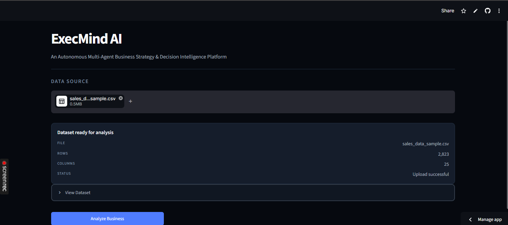
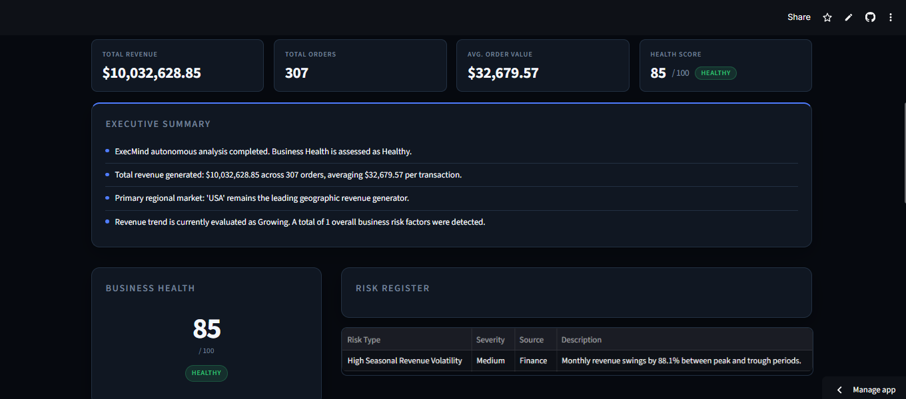
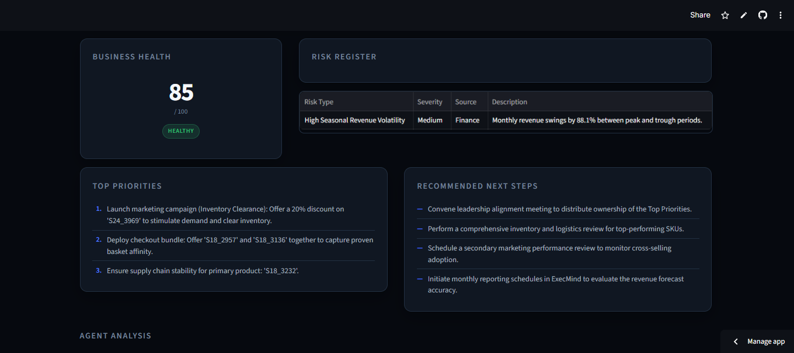
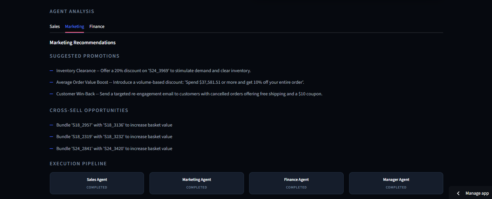
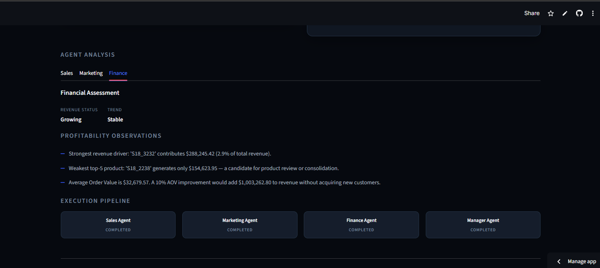
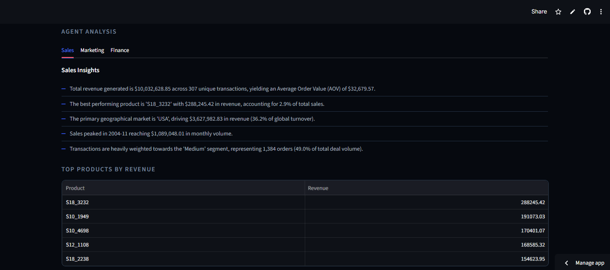

# ExecMind AI

### An Autonomous Multi-Agent Business Strategy & Decision Intelligence Platform

Transform raw sales data into actionable business strategies using an autonomous team of AI agents. ExecMind AI analyzes uploaded business datasets, generates executive insights, identifies risks, recommends marketing and financial strategies, and produces downloadable business reports—all through an intelligent multi-agent workflow.

## 🚀 Live Demo

| Resource | Link |
|----------|------|
| 🌐 Streamlit App | https://execmind.streamlit.app/#exec-mind-ai |
| 📂 GitHub Repository | https://github.com/aaliya1719/execmind-ai |
| 🎥 Demo Video | https://youtu.be/your-video |


## Installation

### Clone the repository

```bash
git clone https://github.com/<your-username>/execmind-ai.git
cd execmind-ai
```

### Install dependencies

```bash
pip install -r requirements.txt
```

### Run the application

```bash
streamlit run app/ui/streamlit_app.py
```

## Overview

Small businesses generate large amounts of sales data, but many lack access to dedicated business analysts or expensive business intelligence platforms. While traditional dashboards present charts and metrics, they rarely explain *why* something happened or *what should happen next*.

ExecMind AI approaches this problem differently. Instead of acting as another analytics dashboard, it functions as an autonomous AI consulting team. After a business dataset is uploaded, specialized AI agents independently analyze sales performance, marketing opportunities, financial health, and operational risks. A manager agent then combines these findings into a single executive report containing practical recommendations that business owners can immediately act upon.

The result is a decision-support system that transforms raw business data into clear, actionable strategy rather than simply displaying statistics.


## Problem Statement

Many small businesses rely on spreadsheets to monitor sales performance, yet interpreting this data often requires business expertise that may not be readily available.

Existing analytics tools primarily answer questions such as:
- What happened?
- How much was sold?
- Which products performed well?

However, they rarely answer higher-level business questions like:
- Why are sales declining?
- Which products should be promoted?
- Which markets should receive more attention?
- What business risks should be addressed first?

Business owners need actionable recommendations rather than isolated metrics.

## Solution

ExecMind AI uses a multi-agent architecture in which each AI agent focuses on a specialized business domain.
The Sales Agent analyzes revenue trends and product performance.
The Marketing Agent identifies promotional opportunities, cross-selling strategies, and market expansion possibilities.
The Finance Agent evaluates financial KPIs, forecasts revenue, and detects business risks.
Finally, the Manager Agent consolidates every agent's findings into a comprehensive executive report containing prioritized recommendations and downloadable outputs.

## Features

- 📊 Upload and analyze business sales datasets in **CSV**, **XLS**, and **XLSX** formats.
- 🤖 Autonomous **multi-agent architecture** powered by specialized AI agents.
- 📈 Comprehensive sales analysis, including revenue trends, top-performing products, and regional performance.
- 📢 AI-generated marketing recommendations, including promotional campaigns, cross-selling opportunities, and market expansion strategies.
- 💰 Financial assessment with key performance indicators (KPIs), revenue forecasting, and profitability insights.
- ⚠️ Automated business risk detection and prioritized action plans.
- 📋 Executive summary combining insights from all specialist agents into a single business strategy report.
- 📥 Export reports in **JSON**, **Markdown**, and **Text** formats.
- 🌐 Interactive Streamlit web interface for dataset upload and report visualization.

## System Architecture

ExecMind AI follows a hierarchical multi-agent architecture in which a central Manager Agent coordinates specialized AI agents responsible for different business domains.

```text
                      ┌──────────────────────┐
                      │        User          │
                      └──────────┬───────────┘
                                 │
                                 ▼
                      ┌──────────────────────┐
                      │   Streamlit Web UI   │
                      └──────────┬───────────┘
                                 │
                                 ▼
                      ┌──────────────────────┐
                      │ Dataset Processing   │
                      └──────────┬───────────┘
                                 │
        ┌────────────────────────┼────────────────────────┐
        ▼                        ▼                        ▼
 ┌──────────────┐        ┌──────────────┐        ┌──────────────┐
 │ Sales Agent  │        │Marketing     │        │Finance Agent │
 │              │        │Agent         │        │              │
 └──────────────┘        └──────────────┘        └──────────────┘
        └────────────────────────┼────────────────────────┘
                                 ▼
                      ┌──────────────────────┐
                      │    Manager Agent     │
                      │ Aggregates Insights  │
                      └──────────┬───────────┘
                                 ▼
                  ┌──────────────────────────┐
                  │ Executive Business Report│
                  │ JSON • MD • TXT          │
                  └──────────┬───────────────┘
                             ▼
                  Dashboard & Downloads
```

## Multi-Agent Workflow

1. The user uploads a business sales dataset.
2. The Manager Agent validates the input and distributes analysis tasks.
3. The Sales Agent analyzes revenue, products, customers, and geographic performance.
4. The Marketing Agent identifies promotional opportunities, cross-selling recommendations, and market expansion strategies.
5. The Finance Agent evaluates financial health, forecasts revenue, and identifies business risks.
6. The Manager Agent consolidates all specialist outputs into a unified executive business report.
7. Users can download the generated report in multiple formats or review it directly through the dashboard.

## Technology Stack

| Category | Technologies |
|----------|--------------|
| Language | Python 3 |
| Frontend | Streamlit |
| AI Framework | Google Agent Development Kit (ADK) |
| Data Processing | Pandas, NumPy |
| Excel Support | openpyxl, xlrd |
| Visualization | Plotly |
| Report Generation | JSON, Markdown, Text |
| Deployment | Streamlit Community Cloud |
| Version Control | Git & GitHub |

## AI Concepts Demonstrated

| Concept | Implementation |
|----------|----------------|
| Multi-Agent System (ADK) | Manager Agent coordinates Sales, Marketing, and Finance agents to perform specialized analyses. |
| Autonomous Agent Workflow | Agents independently complete their assigned tasks before the Manager Agent synthesizes the final report. |
| Agent Skills | Each agent performs domain-specific reasoning and generates structured outputs using specialized tools and logic. |
| Security | File validation, supported file-type restrictions, environment variables, and safe local data processing. |
| Deployability | Application deployed using Streamlit Community Cloud with reproducible setup instructions. |

## Security Considerations

- Sensitive credentials are stored using environment variables (`.env`) and are excluded from version control.
- Uploaded datasets are processed only for analysis and report generation.
- The repository does not contain hardcoded API keys or secrets.


## Usage

1. Launch the Streamlit application.
2. Upload a supported business dataset (`.csv`, `.xls`, or `.xlsx`).
3. Wait for the autonomous agents to complete their analyses.
4. Review the executive summary, sales insights, marketing recommendations, financial assessment, and business risks.
5. Download the generated reports in JSON, Markdown, or Text format.

## 📂 Project Structure

```text
ExecMind-AI/
│
├── adk/                  # Google ADK root agent
│
├── app/
│   ├── agents/           # Sales, Marketing, Finance & Manager agents
│   ├── mcp/              # MCP server and tools
│   ├── ui/               # Streamlit web interface
│   └── utils/            # Shared utilities
│
├── tests/                # Unit tests
├── screenshots/          # README images
│
├── requirements.txt      # Python dependencies
├── README.md             # Project documentation
├── LICENSE               # MIT License
├── .env.example          # Environment variable template
└── .gitignore
```

## Screenshots

### Dashboard



### Executive Summary
  
  


### Marketing Recommendations



### Financial Assessment



### Sales Insights
   


## Future Improvements

- Support additional business data sources and APIs.
- Add conversational querying over generated reports.
- Introduce specialized Operations and Inventory agents.
- Enable scheduled report generation and email delivery.
- Deploy with cloud-based storage and authentication.

## License

This project is licensed under the MIT License. See the `LICENSE` file for details.

## Author

**Aaliya**  
B.Tech Engineering Student

GitHub: https://github.com/aaliya1719  
Kaggle: https://www.kaggle.com/aster1719

## Acknowledgements

This project was developed as part of Kaggle's **5-Day AI Agents: Intensive Vibe Coding Course with Google**, applying concepts such as multi-agent systems, autonomous workflows, and deployable AI applications.